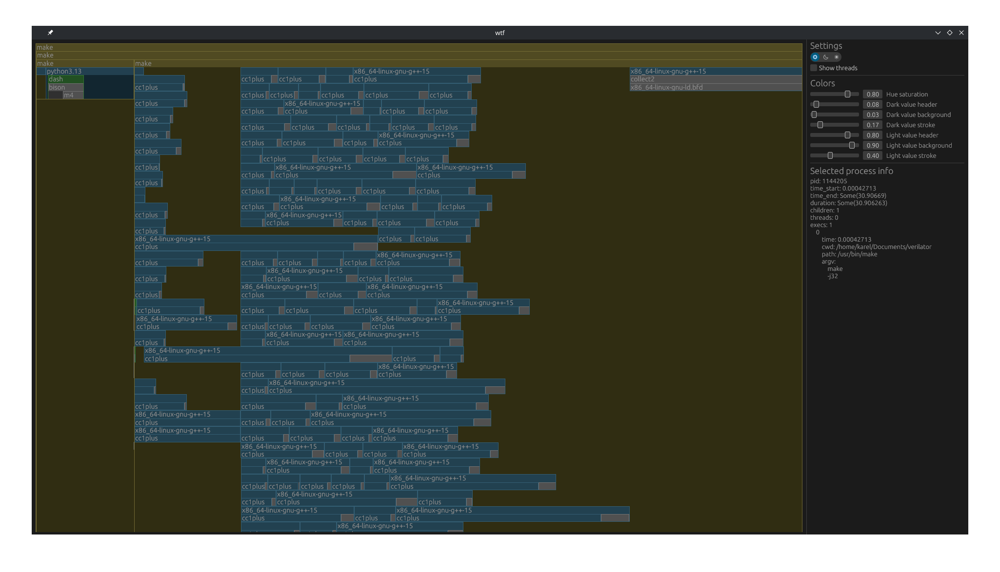

# wtf

A real-time process profiler.



## Background

The original idea is from https://danielchasehooper.com/posts/syscall-build-snooping/.

Some additional resources that were helpful when working on the ptrace mode:

* https://blog.nelhage.com/2010/08/write-yourself-an-strace-in-70-lines-of-code/
* https://www.cyphar.com/blog/post/20160703-remainroot-ptrace-hell

## Build and run instructions

This project only supports Linux for now. The project in written in Rust, so follow
the [Cargo installation instructions](https://doc.rust-lang.org/cargo/getting-started/installation.html).

After that clone and build the project:

```
git clone https://github.com/KarelPeeters/wtf
cd wtf
cargo build --release
```

The resulting binary binary can be found in `target/release/wtf`.

It can be used as `wtf <command>`, which will run the given command and open a GUI showing a real-time profile of the
command and all of its subprocesses.
